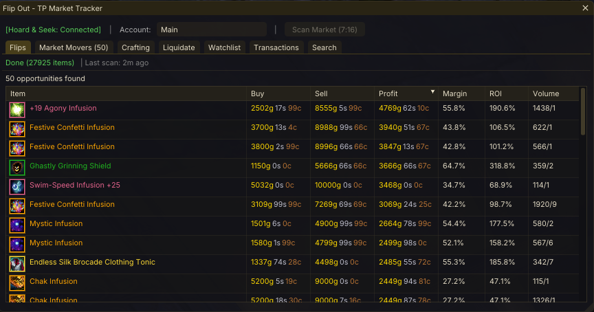
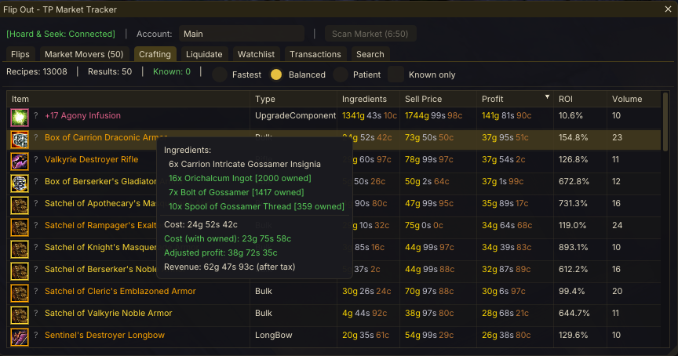
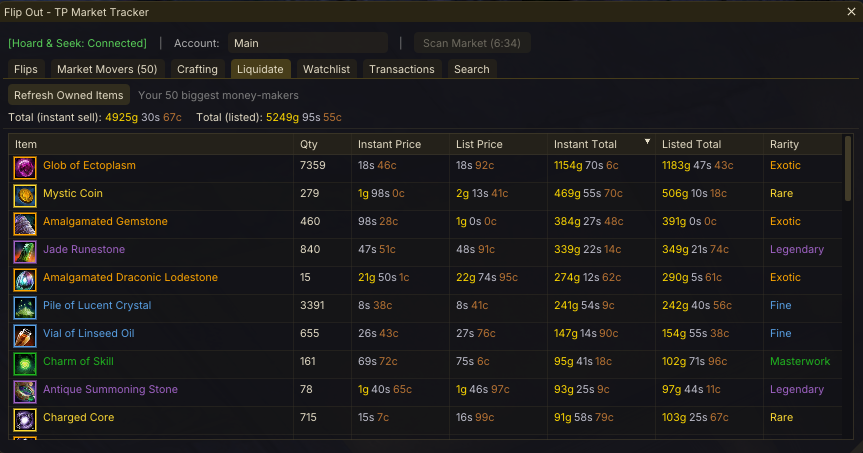
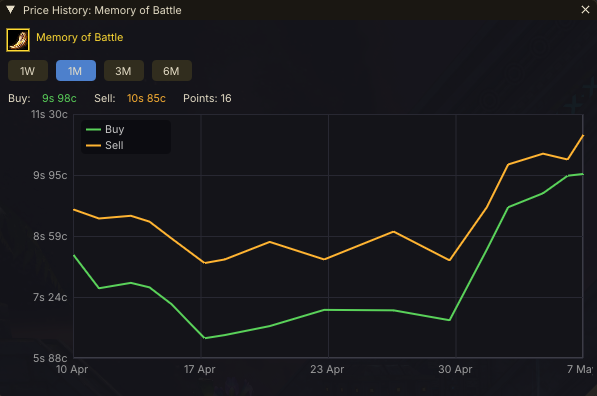

# Flip Out - GW2 Trading Post Market Tracker

A Guild Wars 2 addon for the [Nexus](https://raidcore.gg/Nexus) framework that tracks Trading Post market trends and helps you find profitable flips.






## AI Notice

This addon has been largely created using Claude. I understand that some folks have a moral, financial or political objection to creating software using an LLM. I just wanted to make a useful tool for the GW2 community, and this was the only way I could do it.

If an LLM creating software upsets you, then perhaps this repo isn't for you. Move on, and enjoy your day.

## Features

### Flips Tab

- **Flip Scanner** — Scans all tradeable items via the public GW2 API and ranks them by profit, margin, ROI, or volume
- **Outlier Detection** — Filters manipulated prices to prevent skewed recommendations
- **Owned Item Highlighting** — Items you own are highlighted with a gold tint and owned count

### Market Movers Tab

- **Price Spike Detection** — Detects items with significant price or volume spikes vs their historical average, ranked by spike intensity
- **Owned Item Highlighting** — Items you own are highlighted

### Crafting Tab

- **Crafting Profit Calculator** — Fetches all recipes from the GW2 API and calculates profit per craft
- **Crafting Modes** — Fastest (instant buy/sell), Balanced (instant buy, list sell), Patient (list buy/sell)
- **Known Recipes Filter** — Show only recipes your account has unlocked (requires Hoard & Seek)
- **Ingredient Tooltips** — Hover a recipe to see ingredient details and cost savings from materials you already own

### Liquidate Tab

- **Owned Item Valuation** — Top 50 most valuable tradeable items you own across all storage, sorted by instant sell value
- **Instant & Listed Totals** — Both values include the 15% TP tax
- **Requires Hoard & Seek**

### Watchlist Tab

- **Price Tracking** — Track specific items over time with configurable price alerts
- **Trend Analysis** — Linear regression on price history to detect rising, falling, or stable trends
- **Auto-Refresh** — Watchlist prices update on a configurable interval

### Transactions Tab

- **Pending Orders** — View your active buy orders and sell listings

### Search Tab

- **Item Search** — Search the item cache by name with live prices, margin, profit, and owned count

### Price History

- **Price Graph** — Right-click any item to view a price history graph; switch between 1d, 1w, 1m, 3m, and 6m ranges

### General

- **Right-Click Context Menus** — Add/remove watchlist, search in Hoard & Seek, view price history
- **Persistent Storage** — Price history, watchlist, item cache, and config saved as JSON
- **Community Seed Data** — New installs automatically download ~1 month of community price history so Market Movers works immediately

## Hoard & Seek Integration

Flip Out integrates with [Hoard & Seek](https://github.com/PieOrCake/hoard_and_seek) via Nexus events for:

- Owned item counts in Flips, Market Movers, Crafting, and Search
- Account storage search from item context menus
- Authenticated API access for Transactions
- Crafting recipe unlock filtering
- Full inventory valuation for Liquidate

Flip Out works without Hoard & Seek, but owned item data, Liquidate, Transactions, and crafting unlock filtering will be unavailable.

## Requirements

- Guild Wars 2 with [Nexus addon loader](https://raidcore.gg/Nexus)
- Optional: [Hoard & Seek](https://github.com/PieOrCake/hoard_and_seek) for owned item data and transactions

No API key required — Flip Out uses only public GW2 API endpoints for price data.

## Building

### Prerequisites (Linux cross-compilation)

- `x86_64-w64-mingw32-g++` (MinGW-w64)
- `cmake` >= 3.20
- `curl` (for dependency download)

### Setup & Build

```bash
# Download ImGui v1.80 and nlohmann/json v3.11.3
chmod +x scripts/setup.sh
./scripts/setup.sh

# Build
mkdir -p build && cd build
cmake ..
make -j$(nproc)
```

Output: `build/FlipOut.dll`

### Installation

Copy `FlipOut.dll` to your GW2 Nexus addons directory:
```
<GW2 install>/addons/FlipOut.dll
```

## Usage

1. Open the addon with **Ctrl+Shift+T** or via the Nexus quick access bar
2. Click **Scan Market** in the toolbar to fetch current prices
3. Browse flip opportunities in the **Flips** tab
4. Check **Market Movers** for items with recent price spikes
5. Check **Crafting** for profitable recipes
6. Check **Liquidate** to see which owned items are worth selling
7. Right-click any item to add it to your **Watchlist** or view its **Price History**
8. Check **Transactions** for your pending orders (requires Hoard & Seek)

## How Flips Work

A "flip" is buying via buy order and reselling via sell listing. The Trading Post charges:
- **5% listing fee** (when you list)
- **10% exchange fee** (when the item sells)

```
Profit = Sell Price × 0.85 − Buy Price
```

## Community Seed Data

New installs automatically download `seed_prices.json` from this repo's releases on first load (if fewer than 100 items are tracked locally). This gives Market Movers enough history to work immediately without waiting to build up personal data. The seed is sourced from the public GW2 API and is accurate for all regions.

## Architecture

| File | Purpose |
|------|---------|
| `dllmain.cpp` | Nexus lifecycle, ImGui UI (tabs, tables, graphs, context menus) |
| `TPAPI.h/cpp` | GW2 Trading Post API client (prices, listings, item info) |
| `PriceDB.h/cpp` | Price history storage, watchlist, seed import/export |
| `Analyzer.h/cpp` | Flip detection, market movers, crafting profits, outlier detection, trend analysis |
| `HoardBridge.h/cpp` | Cross-addon integration with Hoard & Seek via Nexus events |
| `IconManager.h/cpp` | Async icon downloading and texture caching |
| `HttpClient.h/cpp` | WinINet HTTP client wrapper |

## License

MIT

## Third-Party Licenses

| Library | Version | License | Link |
|---------|---------|---------|------|
| [Dear ImGui](https://github.com/ocornut/imgui) | v1.80 | MIT | [License](https://github.com/ocornut/imgui/blob/master/LICENSE.txt) |
| [nlohmann/json](https://github.com/nlohmann/json) | v3.11.3 | MIT | [License](https://github.com/nlohmann/json/blob/develop/LICENSE.MIT) |
| [Nexus](https://raidcore.gg/Nexus) | API v6 | MIT | [License](https://github.com/RaidcoreGG/RCGG-lib-nexus-api/blob/main/LICENSE) |
| [Hoard & Seek API](https://github.com/PieOrCake/hoard_and_seek) | v3 | MIT | [License](https://github.com/PieOrCake/hoard_and_seek/blob/main/LICENSE) |
