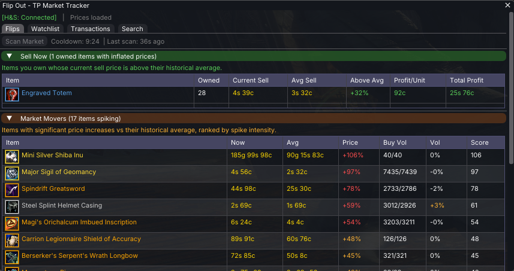

# Flip Out - GW2 Trading Post Market Tracker

A Guild Wars 2 addon for the [Nexus](https://raidcore.gg/Nexus) framework that tracks Trading Post market trends and helps you find profitable flips.

This project is still in development and testing.



## AI Notice

This addon has been 100% created in [Windsurf](https://windsurf.com/) using Claude. I understand that some folks have a moral, financial or political objection to creating software using an LLM. I just wanted to make a useful tool for the GW2 community, and this was the only way I could do it.

If an LLM creating software upsets you, then perhaps this repo isn't for you. Move on, and enjoy your day.

## Features

### Flips Tab

- **Flip Scanner** — Scans all tradeable items via the public GW2 API and ranks them by profit, margin, ROI, or volume
- **Auto-Scan** — Market scan starts automatically when the addon loads, so results are ready by the time you log in
- **Scan Cooldown** — 10-minute minimum between scans to avoid excessive API usage
- **Last Scan Timestamp** — Shows how long ago the last scan completed
- **Outlier Detection** — Filters manipulated prices to prevent skewed recommendations
- **Sell Opportunities** — Surfaces items you own that are currently selling above their historical average (requires [Hoard & Seek](https://github.com/PieOrCake/hoard_and_seek))
- **Market Movers** — Detects items with significant price or volume spikes compared to their historical averages, ranked by spike intensity
- **Owned Item Highlighting** — Items you own are highlighted with a gold tint and owned count in both the Flips and Market Movers tables (requires Hoard & Seek)

### Watchlist Tab

- **Watchlist** — Track specific items over time with configurable price alerts
- **Trend Analysis** — Linear regression on price history to detect rising, falling, or stable trends
- **Auto-Refresh** — Watchlist prices update automatically on a configurable interval

### Transactions Tab

- **Transaction Viewer** — View your pending buy orders and sell listings (requires Hoard & Seek for authenticated API access)

### Search Tab

- **Item Search** — Search the item cache by name with live prices, margin, profit, and owned count
- **Owned Count** — Shows how many of each item you own across all storage locations (requires Hoard & Seek)

### Price History

- **Price History Graph** — Right-click any item to view a detailed price history graph in a separate window
- **Time Ranges** — Switch between 1 day, 1 week, 1 month, 3 months, and 6 months of history
- **Buy/Sell Lines** — Dual-line chart showing both buy and sell price trends over time

### General

- **Right-Click Context Menus** — Right-click any item row to add/remove from watchlist, search in Hoard & Seek, or view price history
- **Item Icons** — Async icon downloading from the GW2 render API with texture caching
- **Persistent Storage** — Price history, watchlist, item cache, and config saved to disk as JSON
- **Community Seed Data** — New users automatically download community price history from this repo so features like Market Movers and Sell Opportunities work immediately

## Hoard & Seek Integration

Flip Out integrates with [Hoard & Seek](https://github.com/PieOrCake/hoard_and_seek) via Nexus events for:

- **Owned item data** — Know which flip candidates and market movers you already own
- **Account search** — Search your account storage directly from item context menus
- **Authenticated API calls** — Transaction data (pending buys/sells) via H&S's API key

Flip Out works without Hoard & Seek, but the Sell Opportunities, owned item highlighting, and Transactions features will be unavailable.

## Requirements

- Guild Wars 2 with [Nexus addon loader](https://raidcore.gg/Nexus) installed
- Optional: [Hoard & Seek](https://github.com/PieOrCake/hoard_and_seek) addon for owned item data and transactions

No API key is required — Flip Out uses only public GW2 API endpoints for price data.

## Building

### Prerequisites (Linux cross-compilation)

- `x86_64-w64-mingw32-g++` (MinGW-w64)
- `cmake` >= 3.20
- `curl` (for dependency download)

### Setup & Build

```bash
# Download ImGui v1.80 and nlohmann/json v3.11.3
chmod +x scripts/setup.sh
./scripts/setup.sh

# Build
mkdir -p build && cd build
cmake ..
make -j$(nproc)
```

The output `FlipOut.dll` will be in the `build/` directory.

### Installation

Copy `FlipOut.dll` to your GW2 Nexus addons directory:
```
<GW2 install>/addons/FlipOut.dll
```

## Usage

1. Open the addon with **Ctrl+Shift+T** or via the Nexus quick access bar
2. The market scan starts automatically on load — results should be ready when you open the window
3. Browse flip opportunities in the **Flips** tab
4. Check the **Sell Opportunities** and **Market Movers** sections for items you own or items that are spiking
5. Right-click any item to add it to your **Watchlist**, search in Hoard & Seek, or view its **Price History**
6. Check the **Transactions** tab to see your pending orders (requires Hoard & Seek)

## How Flips Work

A "flip" is buying an item via buy order and reselling it via sell listing. The Trading Post charges:
- **5% listing fee** (paid when you list)
- **10% exchange fee** (paid when the item sells)

Flip Out calculates profit after both fees:
```
Profit = Sell Price - (5% of Sell) - (10% of Sell) - Buy Price
```

## Community Seed Data

The `data/seed_prices.json` file contains community-contributed price history. New users' addons automatically download this data on first load if their local history has fewer than 100 tracked items. This allows features like Market Movers and Sell Opportunities to work immediately without waiting days to build up personal history.

The seed data is sourced from the public GW2 API. The Trading Post is global across all regions (NA/EU), so this data is accurate for everyone.

## Architecture

| File | Purpose |
|------|---------|
| `dllmain.cpp` | Nexus lifecycle, ImGui UI (tabs, tables, graphs, context menus) |
| `TPAPI.h/cpp` | GW2 Trading Post API client (public endpoints: prices, listings, item info) |
| `PriceDB.h/cpp` | Price history storage, watchlist, seed import/export |
| `Analyzer.h/cpp` | Flip detection, sell opportunities, market movers, outlier detection, trend analysis |
| `HoardBridge.h/cpp` | Cross-addon integration with Hoard & Seek via Nexus events |
| `IconManager.h/cpp` | Async icon downloading and texture loading |
| `HttpClient.h/cpp` | WinINet HTTP client wrapper |

## Compatibility

- **Nexus API**: v6
- **ImGui**: v1.80
- **nlohmann/json**: v3.11.3
- Matched to [Hoard & Seek](https://github.com/PieOrCake/hoard_and_seek) for compatibility

## License

MIT
